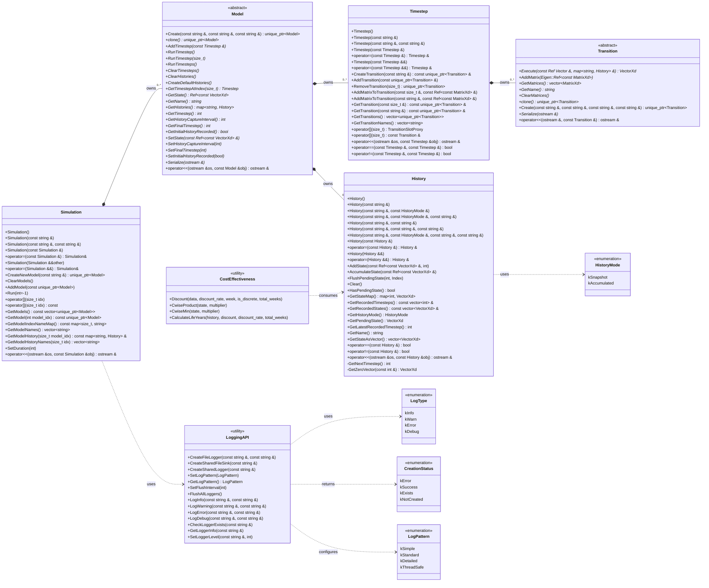
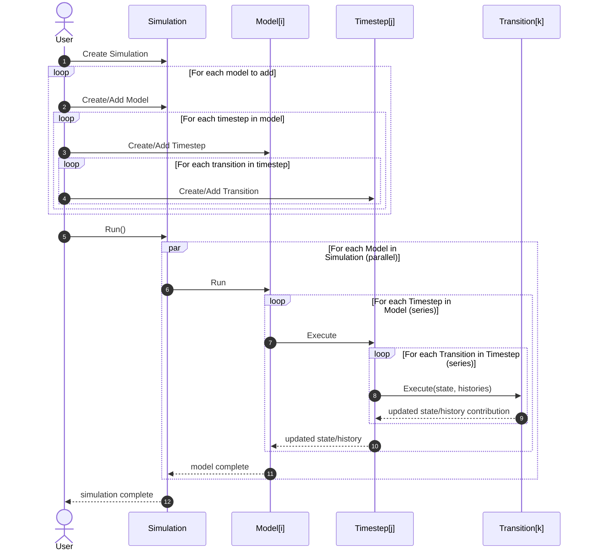

# UML Diagrams

This page uses Mermaid so diagrams remain human-editable in plain text.

## Public API Diagram

This diagram is the external library view and reflects the target workflow:
one Simulation owns many Models, each Model owns many Timesteps, each
Timestep owns many Transitions.

## Internals Diagram

This diagram is implementation-focused and shows the relationship between
abstract classes and how it impacts the stored components for ownership
purposes.

```mermaid
classDiagram
    direction LR

    class Simulation {
        -string _log_name
        -vector~unique_ptr~Model~~ _models
        -int _duration
        -vector~int~ _parameter_change_times
        -bool _stratify_entering_cohort
        -bool _build_summary_stats
        -bool _save_state_history
        -vector~int~ _timesteps_to_report
        -bool _pivot_long
        +Simulation()
        +Simulation(const string log_name)
        +Simulation(const string log_name, const string log_filepath)
        +Simulation(const Simulation &other)
        +operator=(const Simulation &other) Simulation &
        +Simulation(const Simulation &&other)
        +operator=(const Simulation &&other) Simulation &
    }

    class Model {
        <<abstract>>
    }

    class Markov {
        -vector~Timestep~ _timestep_vector
        -VectorXd _state
        -string _name
        -string _log_name
        -map~string, History~ _histories
        -int _current_timestep
        -int _history_capture_interval
        -int _final_timestep
        -bool _initial_history_recorded
        -ResetHistoryTracking()
        -GetLatestRecordedTimestep()
        -ShouldRecordHistoryAtTimestep(int timestep)
        -RecordHistoryAtCurrentTimestep()
        -SetupHistory()
        +Markov()
        +Markov(const string &name, const string log_name)
        +Markov(Markov &other)
        +operator=(Markov &other) Markov &
        +Markov(Markov &&other)
        +operator=(Markov &&other) Markov &
        +SetState(state) override
        +GetState() VectorXd override
        +AddTimestep(const Timestep &) override
        +GetTimestepAtIndex(size_t) Timestep override
        +ClearTimesteps() override
        +RunTimestep() override
        +RunTimestep(size_t) override
        +RunTimesteps() override
        +GetHistories() map~string, History~ override
        +ClearHistories() override
        +CreateDefaultHistories() override
        +SetFinalTimestep(final_timestep) override
        +clone() unique_ptr~Model~ override
    }

    class Transition {
        <<abstract>>
    }

    class TransitionBase {
        <<abstract>>
        -string _name
        -string _log_name
        -vector~MatrixXd~ _transition_matrices
        +GetMatrices() const vector~MatrixXd~
        +AddMatrix(const Eigen::Ref~const MatrixXd~ &) override
        +GetName() string override
        +ClearMatrices() override
        +Serialize(ostream &) override
    }

    class Migration {
        +Execute(state, histories) VectorXd
        +Create(name, log_name) unique_ptr~Transition~
    }

    class Behavior {
        +Execute(state, histories) VectorXd
        +Create(name, log_name) unique_ptr~Transition~
    }

    class Intervention {
        +Execute(state, histories) VectorXd
        +Create(name, log_name) unique_ptr~Transition~
    }

    class Overdose {
        +Execute(state, histories) VectorXd
        +Create(name, log_name) unique_ptr~Transition~
    }

    class BackgroundDeath {
        +Execute(state, histories) VectorXd
        +Create(name, log_name) unique_ptr~Transition~
    }

    class History {
        -string _name
        -string _log_name
        -HistoryMode _mode
        -vector~int~ _timesteps
        -vector~VectorXd~ _states
        -VectorXd _pending_state
        +AddState(state, timestep)
        +RecordSnapshot(state, timestep)
        +AccumulateState(state)
        +FlushPendingState(timestep, state_size)
        +GetLatestRecordedTimestep() int
        +GetStateMap() map~int, VectorXd~
        +GetStateAsVector() vector~VectorXd~
    }

    Simulation *-- "0..*" Model : owns
    Model <|-- Markov : implements

    Transition <|-- TransitionBase : extends
    TransitionBase <|-- Migration : implements
    TransitionBase <|-- Behavior : implements
    TransitionBase <|-- Intervention : implements
    TransitionBase <|-- Overdose : implements
    TransitionBase <|-- BackgroundDeath : implements

    Markov *-- "0..*" Timestep : owns
    Timestep *-- "0..*" Transition : owns
    Markov *-- "0..*" History : owns
    Migration <.. History : uses
    Behavior <.. History : uses
    Intervention <..> History : uses and updates
    Overdose <..> History : uses and updates
    BackgroundDeath <..> History : uses and updates



```

## Execution Flow Diagram

This sequence follows the requested external flow and execution semantics.

