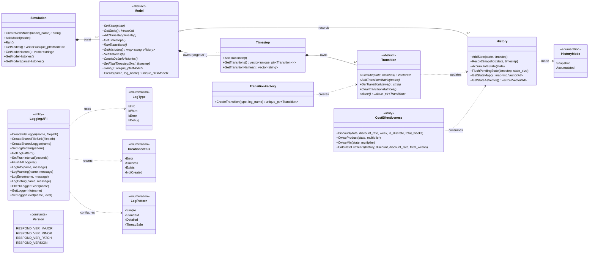
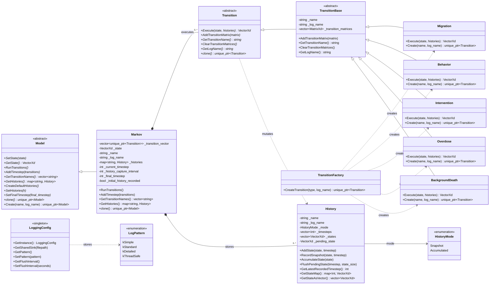
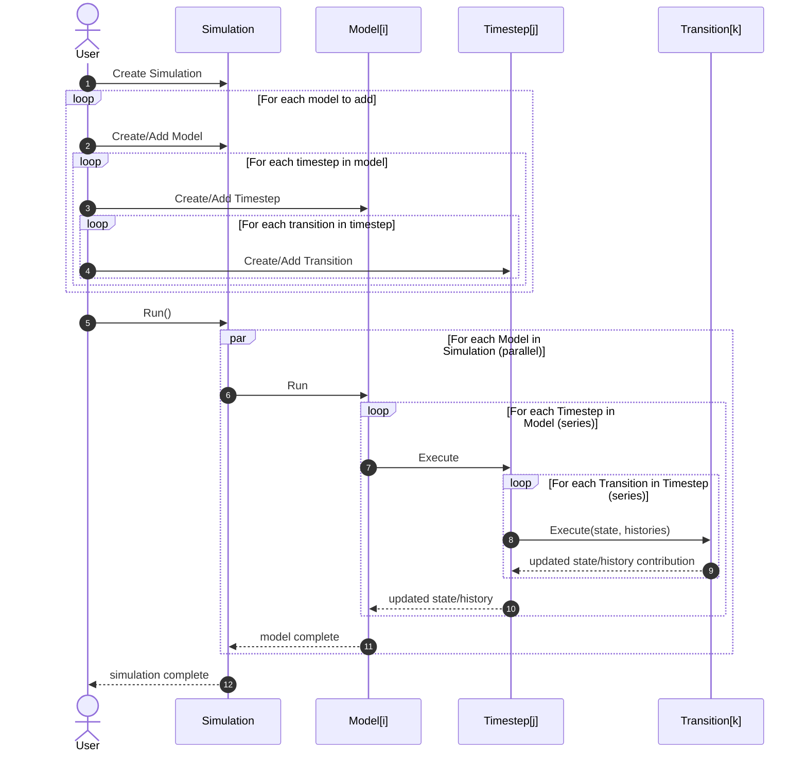

# UML Diagrams

This page uses Mermaid so diagrams remain human-editable in plain text.

## Public API Diagram

This diagram is the external library view and reflects the target workflow:
one Simulation owns many Models, each Model owns many Timesteps, each
Timestep owns many Transitions.

## Internals Diagram

This diagram is implementation-focused and intentionally verbose.

## Execution Flow Diagram

This sequence follows the requested external flow and execution semantics.

## Notes

- Public API diagram includes every component from headers in include/respond: simulation, model, timestep, transition, transition_factory, history, logging, cost_effectiveness, and version.
- Current implementation detail: Model::Create currently returns a Markov instance.
- Current implementation detail: TransitionFactory::CreateTransition resolves migration, behavior, intervention, overdose, and background_death.
